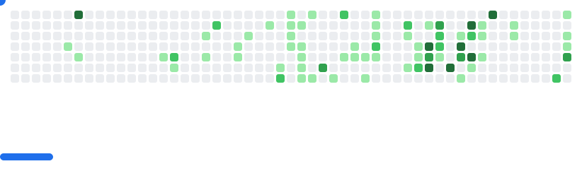

# Hello and welcome to my GitHub page! 🍄
<!--
**krovostcora/krovostcora** is a ✨ _special_ ✨ repository because its `README.md` (this file) appears on your GitHub profile.

Here are some ideas to get you started:

- 🔭 I’m currently working on ...
- 🌱 I’m currently learning ...
- 👯 I’m looking to collaborate on ...
- 🤔 I’m looking for help with ...
- 💬 Ask me about ...
- 📫 How to reach me: ...
- 😄 Pronouns: ...
- ⚡ Fun fact: ...
-->

### My portfolio site: [click on me!](https://star-pulse-9.resiz.es/)

---

<picture>
  <!-- Use dark image when user prefers dark mode -->
  <source media="(prefers-color-scheme: dark)" srcset="images/breakout-dark.svg" />
  <!-- Use light image when user prefers light mode -->
  <source media="(prefers-color-scheme: light)" srcset="images/breakout-light.svg" />
  <!-- Fallback -->
  
</picture>

### 📊 GitHub Stats

### I’m currently working on those projects:

  

    
    <h4>1) <b>Events Manager</b> (React Native)</h4>
    
— The app which I'm doing during my summer internship for practicing React Native.

    

      <a href="https://github.com/krovostcora/events-Rnative/tree/main">frontend</a> • 
      <a href="https://github.com/krovostcora/events_server">server</a>
    

  

---

    
  

    <h4>2) <b>StoryBridge Webpage</b></h4>
    
— Currently we are on design part, so you will not find much in this repo

    

      <a href="https://github.com/AbiWebAngel/StoryBridgeBlog">Repository link</a>
    

  

